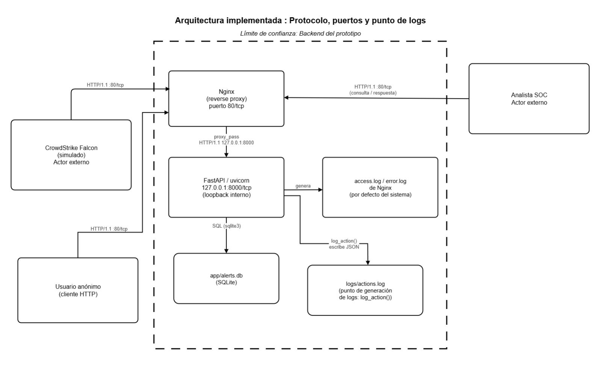
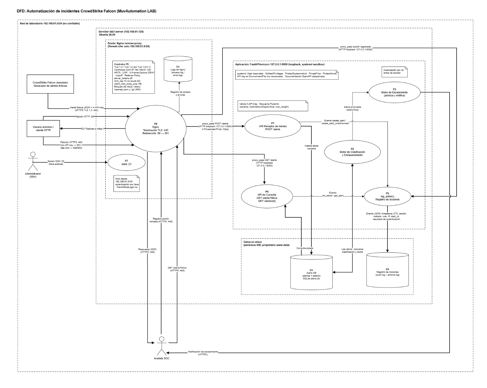
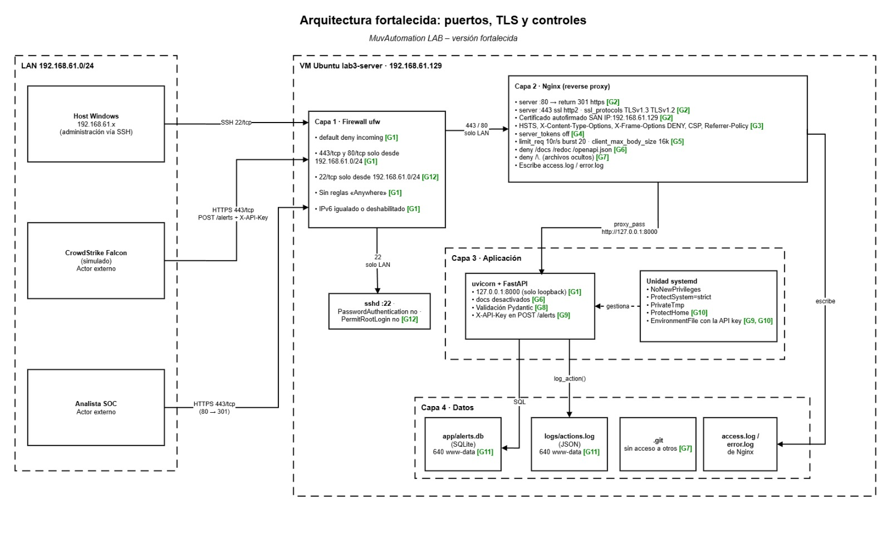

# Informe — Parte 2 (Entrega 2): arquitectura fortalecida

Laboratorio FDSI: "Aplicación web pública por HTTP: construir, atacar, detectar,
corregir y verificar"

> Punto de partida: la versión inicial documentada en [`INFORME.md`](INFORME.md) (Parte 1).
> La comparación resumida entre ambas partes está en el
> [`README.md`](README.md#parte-1-vs-parte-2--qué-cambió-y-qué-descubrimos).

---

## 1. Portada y datos del equipo

- **Proyecto:** MuvAutomation — Automatización de incidentes de CrowdStrike Falcon (prototipo de laboratorio, datos ficticios)
- **Laboratorio:** Lab 3 — Aplicación web pública por HTTP
- **Entrega:** 2 (DFD completo, threat modeling actualizado, arquitectura fortalecida)
- **Integrantes:**
  - Ana Gabriela Fiquitiva Poveda
  - Juan David Valero Abril
- **Servidor:** `lab3-server` — `192.168.61.129` (Ubuntu 26.04.1 LTS, VM VMware, red NAT `192.168.61.0/24`)

---

## 2. Objetivo de esta parte

Partir de la arquitectura inicial (Parte 1) y aplicar el hilo:

**Arquitectura inicial → Gap identificado → Riesgo/Amenaza → Mejora implementada → Arquitectura fortalecida**

Con eso se busca:

- completar y mejorar el DFD;
- agregar a la tabla de threat modeling los gaps, amenazas y debilidades encontrados;
- reforzar los diagramas de arquitectura;
- mostrar con evidencia las mejoras frente a la versión inicial.

---

## 3. Arquitectura inicial (línea base)




| Capa | Estado en la Parte 1 |
|---|---|
| Entrada | Nginx `listen 80` + `listen [::]:80`, `server_name _` |
| Protocolo | HTTP/1.1 en claro, sin TLS |
| App | FastAPI/uvicorn `127.0.0.1:8000`; `/docs`, `/redoc` y `/openapi.json` expuestos |
| Datos | `app/alerts.db` (SQLite) y `logs/actions.log` sin identidad del usuario |
| Host | `ufw`: 80/tcp solo LAN, pero **OpenSSH desde Anywhere (v4 y v6)** |
| Servicio | systemd `User=www-data`, sin sandboxing |
| Repositorio | Público de forma temporal durante el despliegue |

**Problemas encontrados en los diagramas de la Parte 1:**
- En el DFD, el "Registro de Acciones (audit log)" aparece **fuera** del límite de confianza, aunque vive en el servidor.
- El DFD no muestra Nginx, el Usuario anónimo, el acceso SSH de administración, el protocolo ni los puertos.
- Hay **un solo** límite de confianza. Faltan al menos tres: red ↔ borde (Nginx), borde ↔ aplicación (loopback) y aplicación ↔ datos (disco).

---

## 4. Gap → Riesgo/Amenaza → Mejora implementada

| ID | Arquitectura inicial | Gap identificado | STRIDE | Riesgo / amenaza | Mejora implementada | Arquitectura fortalecida |
|---|---|---|---|---|---|---|
| G1 | Nginx `:80` HTTP | Tráfico en claro | I, T | Sniffing/MITM en la LAN: se leen o alteran alertas en tránsito | HTTPS en `:443`; `:80` responde solo `301 → https` | Todo el tráfico de negocio va cifrado |
| G2 | — | No hay política de versión TLS | I | Downgrade a TLS 1.0/1.1 o cifrados débiles | `ssl_protocols TLSv1.3 TLSv1.2`, suites ECDHE + AES-GCM/CHACHA20, `ssl_session_tickets off` | Solo protocolos vigentes |
| G3 | — | Falta HSTS | T | SSL-stripping en la primera visita | `Strict-Transport-Security: max-age=31536000` | El navegador fuerza HTTPS |
| G4 | ufw: OpenSSH Anywhere | SSH abierto a cualquier red | S, E | Fuerza bruta contra SSH | `ufw` limita el 22/tcp a `192.168.61.0/24`; `PasswordAuthentication no`, `PermitRootLogin no` | Administración solo desde la LAN y con llave |
| G5 | `listen [::]:80` + reglas v6 | IPv6 escuchando sin necesidad | I | Superficie paralela sin filtrar | Se quitó `listen [::]`; se eliminaron las reglas v6 de SSH | Una sola pila expuesta |
| G6 | FastAPI por defecto | `/docs`, `/redoc`, `/openapi.json` públicos | I | Reconocimiento: el atacante obtiene el mapa completo de la API | `docs_url=None, redoc_url=None, openapi_url=None` + 404 en Nginx | La API no publica su mapa |
| G7 | `server_tokens` on | Versión de Nginx visible y sin cabeceras de seguridad | I | Fingerprinting y clickjacking/MIME sniffing | `server_tokens off`, `nosniff`, `X-Frame-Options DENY`, `Referrer-Policy`, CSP; uvicorn `--no-server-header` | Respuestas sin versión y con cabeceras |
| G8 | Sin límites | Sin rate limit ni tamaño máximo (H5) | D | Flood contra `POST /alerts` | `limit_req 10 r/s burst 20` (429), `client_max_body_size 16k`, timeouts | Ingesta acotada |
| G9 | `severity: str` libre | Entrada sin validar | T | Datos basura o inyección en logs y dashboards | `Literal` en severity, `max_length`, `pattern` en hostname, `extra="forbid"` | Se rechaza (422) todo lo que no cumple el esquema |
| G10 | `POST /alerts` abierto | No se autentica el origen (H1) | S | Alertas falsas "de Falcon" | Cabecera `X-API-Key` comparada con `secrets.compare_digest`; key en `EnvironmentFile`; *fail closed* | Solo entra el emisor que tiene la key |
| G11 | systemd básico | Servicio sin sandboxing | E | Si se compromete la app, el atacante escribe en todo el disco | `NoNewPrivileges`, `ProtectSystem=strict`, `ReadWritePaths` solo para la DB y los logs, `PrivateTmp`, `CapabilityBoundingSet=` | Proceso confinado |
| G12 | `.git`/`.venv` `rwxrwxr-x`; repositorio público | Permisos amplios y exposición del código | I, T | Lectura o modificación del código y del historial | `chmod o-rwx`, DB y logs en 640, `location ~ /\.` → 404, repositorio privado + deploy key | Código y datos con mínimo privilegio |
| G13 | Motores de clasificación y escalamiento solo en el diseño | Toda alerta queda en `new`; la priorización es manual | D, T | Una alerta crítica se pierde entre muchas y la priorización no es consistente | **Motor de Clasificación y Enriquecimiento** (`app/enrichment.py`): índice local de MITRE ATT&CK v19.2 (697 técnicas) + `risk_score` 0–100 + marca `tactic_mismatch` si la táctica no corresponde a la técnica. **Motor de Escalamiento** (`app/escalation.py`): escala automáticamente si el score es ≥ 70 y notifica en `logs/escalations.log` | Cada alerta sale clasificada, enriquecida y, si es crítica, escalada |
| G14 | — | Consultar reputación de IPs exige una API externa (AbuseIPDB), que abre un flujo nuevo de salida | T, I, D | Respuesta externa manipulada, fuga de IPs internas a un tercero, caída o agotamiento de cuota que bloquea la ingesta | Solo IPs públicas (las privadas del laboratorio no salen); HTTPS con certificado verificado; clave en `EnvironmentFile`; timeout de 3 s; respuesta leída hasta 64 KB y validada por campo; caché de 1 h; presupuesto diario; ejecución en segundo plano (*fail soft*) | La integración externa no puede bloquear ni contaminar el sistema |
| G15 | `ufw default allow outgoing` | Salida a Internet sin restricción | I, E | Si la app se compromete, el atacante puede exfiltrar datos o abrir C2 hacia cualquier destino | `ufw default deny outgoing` + permitir solo DNS (53), NTP (123/udp) y 80/443 tcp (apt y AbuseIPDB) | La salida se limita a lo necesario |
| G16 | `GET /alerts` abierto; no se registra quién actúa | Sin identidad ni roles del analista (H3, H4, H6) | S, R, I, E | Cualquiera lee las alertas; nadie responde por las acciones; un lector puede escalar o cerrar | Clave por analista con rol (`lector` / `respondedor`) en `MUV_ANALYSTS`; `POST /alerts/{id}/actions` con 401 / 403 / 409; tabla `alert_actions`; `actor` y `result` en cada línea de `actions.log`; claves de ejemplo rechazadas (*fail closed*) | Cada lectura y cada acción tiene un responsable identificado y autorizado |

---

## 5. Threat modeling actualizado (STRIDE H1–H6 con estado)

| ID | STRIDE | Elemento | Hipótesis (Parte 1) | Estado en la Parte 2 |
|----|--------|----------|----------------------|----------------------|
| H1 | Spoofing | `POST /alerts` | Cualquiera envía alertas haciéndose pasar por Falcon | **Mitigado (G10):** sin `X-API-Key` válida → 401 y queda en el log `create_alert_unauthorized` |
| H2 | Tampering | `alerts.db` | Modificación directa del archivo sin rastro | **Parcial (G11/G12):** solo `www-data` escribe (640, sandbox) y cada cambio de estado queda en `alert_actions` y `actions.log`. La firma o hash por registro queda para la Parte 3 |
| H3 | Repudiation | `actions.log` | El log no identifica a un analista | **Mitigado (G16):** cada acción registra `actor=analyst:<nombre>`, rol y resultado, también en la tabla `alert_actions`. Límite: la clave es estática, sin MFA ni SSO (Parte 3) |
| H4 | Information Disclosure | `GET /alerts` | Todo es visible sin autenticación | **Mitigado (G1/G6/G16):** lectura solo con clave de analista (401 sin ella), cifrada con TLS y sin docs públicos. Falta el filtrado de campos por rol (Parte 3) |
| H5 | Denial of Service | `POST /alerts` / uvicorn | Un flood de alertas agota el proceso | **Mitigado (G8/G9/G14):** rate limit (429), tamaño máximo (413), timeouts, y el enriquecimiento externo corre en segundo plano con presupuesto |
| H6 | Elevation of Privilege | Motor de Escalamiento | Un analista de bajo privilegio fuerza un escalamiento | **Mitigado (G13/G16):** el motor ya existe; un `lector` que intenta `escalate`/`close` recibe 403 y queda registrado como `action_*_forbidden` |

Los gaps **G1–G16** de la sección 4 se suman a esta tabla como amenazas nuevas encontradas en el análisis.

**Amenazas nuevas que introduce la propia Parte 2** (se analizan porque cada mejora también cambia la superficie):

| Nueva pieza | Amenaza | Control |
|---|---|---|
| Llamada a AbuseIPDB | Tampering / Info Disclosure / DoS del proveedor | G14 |
| Claves de emisor y de analista | Robo o filtración de la clave (Spoofing) | Van fuera del repositorio (`/etc/muvautomation.env`, 640), solo viajan por TLS, se comparan en tiempo constante, se rechazan los valores de ejemplo, y los fallos quedan en el log |
| Índice MITRE versionado | Un índice alterado cambia la clasificación | Se genera desde el bundle oficial con `scripts/build_mitre_index.py`, se revisa en git y el proceso no puede escribirlo (`ProtectSystem=strict`) |
| `logs/escalations.log` | Notificaciones que nadie lee (Repudiation operativo) | En producción el canal sería correo o ticket (Parte 3); por ahora es evidencia verificable |

---

## 6. Respuestas a las preguntas guía

1. **Si tengo HTTP, ¿cómo migro correctamente a HTTPS?**
   No hay un dominio público (IP NAT `192.168.61.129`), así que Let's Encrypt no aplica. Se usa un **certificado autofirmado con SAN = IP** (sección 8, paso 1). Después:
   - un `server :443 ssl` con ese certificado;
   - el `server :80` deja de hacer proxy y solo responde `return 301 https://…`;
   - se agrega HSTS;
   - `X-Forwarded-Proto` pasa a valer `https`;
   - `ufw` abre `443/tcp` solo desde la LAN.
2. **Si utilizo TLS, ¿qué versión debería configurar?**
   **TLS 1.3** como preferida y **TLS 1.2** solo por compatibilidad, con suites ECDHE + AEAD. TLS 1.0 y 1.1 (obsoletas por la RFC 8996) y SSLv3 quedan deshabilitadas.
3. **¿Estoy exponiendo servicios o puertos que no necesito?**
   Sí:
   - SSH `:22` abierto a *Anywhere* (v4 y v6);
   - Nginx escuchando también en IPv6;
   - `/docs`, `/redoc` y `/openapi.json`, que publicaban el mapa de la API.

   El `8000` ya estaba bien, porque solo escucha en loopback.
4. **¿Qué componentes deberían estar restringidos?**
   - SSH: solo desde la LAN y con llave;
   - `alerts.db` y `actions.log`: solo `www-data`, permisos 640;
   - `.git`: sin acceso para otros usuarios y bloqueado en Nginx;
   - la documentación de la API: desactivada;
   - `POST /alerts`: solo con API key;
   - la lectura y las acciones sobre alertas: solo analistas con clave, y escalar o cerrar solo con rol `respondedor`;
   - la salida a Internet: solo DNS, NTP y 80/443;
   - el proceso de la app: sandbox de systemd.
5. **¿Qué controles puedo agregar para reducir la superficie de ataque?**
   Los de G1–G16:
   - TLS, redirección y HSTS;
   - cabeceras de seguridad y `server_tokens off`;
   - rate limit, tamaño máximo y timeouts;
   - validación estricta de entrada;
   - API key del emisor y claves con rol para los analistas;
   - `ufw` por CIDR, de entrada y de salida;
   - sandboxing y permisos mínimos.

   También cuenta **lo que decidimos no agregar**. Evaluamos varias APIs de threat intelligence (VirusTotal, AlienVault OTX, abuse.ch, Shodan) y solo integramos MITRE ATT&CK, que funciona offline, y AbuseIPDB, con controles. Cada API extra suma un flujo de salida, una clave y amenazas nuevas; VirusTotal y abuse.ch quedan para cuando las alertas tengan campos de hash o dominio.
6. **¿Cómo cambia mi arquitectura después del análisis de amenazas?**
   - Pasa de **un** límite de confianza a **cuatro zonas**: red de laboratorio (no confiable), borde Nginx/TLS, aplicación en loopback con sandbox y datos en disco.
   - Hay un solo punto de entrada cifrado (`:443`), y el `:80` solo redirige.
   - La administración queda aislada en la LAN.
   - Los motores de clasificación y escalamiento, que en la Parte 1 eran solo diseño, ahora existen, y la única salida a Internet (AbuseIPDB) es un flujo explícito y controlado.
   - Cada control queda amarrado a un gap concreto (sección 4).

---

## 7. Diagramas de la arquitectura fortalecida

> *Diagramas de la versión fortalecida: DFD y arquitectura.*

**DFD fortalecido** (varios límites de confianza, audit log dentro del servidor, flujos HTTPS, controles anotados):



**Arquitectura fortalecida** (puertos, TLS, firewall y controles por capa):



---

## 8. Cambios implementados

| Archivo | Cambio |
|---|---|
| [`nginx/muvautomation.conf`](nginx/muvautomation.conf) | `:80` → `301`; `:443` con TLS 1.3/1.2, HSTS y cabeceras, `server_tokens off`, `limit_req` (429), `client_max_body_size 16k`, timeouts, 404 en `/docs`, `/redoc`, `/openapi.json` y `/.*`; sin `listen [::]` |
| [`app/main.py`](app/main.py) | Docs y OpenAPI desactivados; `AlertIn` estricto (`Literal`, `max_length`, `pattern`, `extra="forbid"`, `source_ip` validada); `require_api_key` y `require_analyst` con `secrets.compare_digest` y *fail closed*; `POST /alerts/{id}/actions` con roles; filtros en `GET /alerts` (`severity`, `status`, `min_score`, `limit`); migración de la DB de la Parte 1 sin perder datos; `actor` y `result` en el audit log |
| [`app/enrichment.py`](app/enrichment.py) | Motor de Clasificación y Enriquecimiento: MITRE ATT&CK local + AbuseIPDB con controles (G13, G14) |
| [`app/escalation.py`](app/escalation.py) | Motor de Escalamiento: umbral configurable y notificación en `logs/escalations.log` (G13) |
| [`app/data/mitre_attack_index.json`](app/data/mitre_attack_index.json) | Índice compacto de ATT&CK v19.2 (697 técnicas, 454 KB), generado con [`scripts/build_mitre_index.py`](scripts/build_mitre_index.py) |
| [`tests/test_api.py`](tests/test_api.py) | 24 pruebas automatizadas de los controles y los motores |
| [`deploy/muvautomation-api.service`](deploy/muvautomation-api.service) | Ruta real `/opt/fdsi-lab3`, `EnvironmentFile`, `--proxy-headers`, `--no-server-header`, `UMask=0027` y directivas de sandboxing |
| [`deploy/muvautomation.env.example`](deploy/muvautomation.env.example) | Plantilla de los secretos: clave del emisor, analistas con rol, umbral y clave de AbuseIPDB. El archivo real vive en `/etc/muvautomation.env` y no se versiona |

**Cambio de ejecución:** `app/` ahora es un paquete. Tanto en local como en el servidor se arranca desde la raíz del repositorio con `uvicorn app.main:app` (la unidad systemd ya lo hacía así).

### Procedimiento en el servidor (orden seguro)

```bash
cd /opt/fdsi-lab3 && git pull
.venv/bin/pip install -r app/requirements.txt

# 1. Certificado autofirmado con SAN = IP del laboratorio (G1)
sudo openssl req -x509 -newkey rsa:3072 -nodes -days 365 \
  -keyout /etc/ssl/private/lab3-server.key -out /etc/ssl/certs/lab3-server.crt \
  -subj "/CN=lab3-server" -addext "subjectAltName=IP:192.168.61.129"
sudo chmod 600 /etc/ssl/private/lab3-server.key

# 2. Secretos fuera del repositorio (G10, G14, G16)
sudo install -m 640 -o root -g www-data deploy/muvautomation.env.example /etc/muvautomation.env
sudo sed -i "s/^MUV_API_KEY=.*/MUV_API_KEY=$(openssl rand -hex 32)/" /etc/muvautomation.env
sudo sed -i "s/CAMBIAR_CLAVE_ANA/$(openssl rand -hex 32)/; s/CAMBIAR_CLAVE_JUAN/$(openssl rand -hex 32)/" /etc/muvautomation.env
sudoedit /etc/muvautomation.env   # opcional: ABUSEIPDB_API_KEY (cuenta gratuita)
# Si quedan valores de ejemplo, la API los rechaza: fail closed.

# 3. Servicio con sandboxing (G11)
sudo cp deploy/muvautomation-api.service /etc/systemd/system/
sudo systemctl daemon-reload && sudo systemctl restart muvautomation-api

# 4. Nginx fortalecido (G1-G3, G5-G8, G12)
sudo cp nginx/muvautomation.conf /etc/nginx/sites-available/fdsi-lab3
sudo nginx -t && sudo systemctl reload nginx

# 5. Firewall: PRIMERO los allow, DESPUÉS los delete (lección de la Parte 1, §7) (G4, G5)
sudo ufw allow from 192.168.61.0/24 to any port 22 proto tcp
sudo ufw allow from 192.168.61.0/24 to any port 443 proto tcp
sudo ufw status numbered          # identificar los números de "OpenSSH ALLOW Anywhere" (v4 y v6)
sudo ufw delete <n>               # borrar esas reglas, de la más alta a la más baja

# 5b. Filtrado de salida (G15): primero los allow out, después el default deny
sudo ufw allow out 53
sudo ufw allow out 123/udp
sudo ufw allow out 80/tcp         # apt
sudo ufw allow out 443/tcp        # apt, AbuseIPDB
sudo ufw default deny outgoing

# 6. SSH solo con llave (G4) - probar primero la llave desde otra terminal
sudo sed -i 's/^#\?PasswordAuthentication.*/PasswordAuthentication no/; s/^#\?PermitRootLogin.*/PermitRootLogin no/' /etc/ssh/sshd_config
sudo sshd -t && sudo systemctl reload ssh

# 7. Permisos mínimos (G12)
sudo chmod -R o-rwx /opt/fdsi-lab3
sudo chmod 640 /opt/fdsi-lab3/app/alerts.db /opt/fdsi-lab3/logs/actions.log
```

Además hay que volver a poner el repositorio de GitHub en **privado** y clonar con una deploy key (G12).

---

## 9. Evidencias antes / después

### 9.1 Pruebas automatizadas (ejecutadas el 2026-09-23)

`python -m pytest -q` → **24 passed**. Las pruebas están en [`tests/test_api.py`](tests/test_api.py):

| Prueba | Parte 1 | Parte 2 (obtenido) |
|---|---|---|
| `GET /` | 200 | 200 |
| `GET /docs`, `/redoc`, `/openapi.json` | 200 | **404** |
| `POST /alerts` sin `X-API-Key`, con key incorrecta o con clave de analista | 201 | **401** |
| `POST /alerts` con key correcta | 201 | 201 |
| `POST` con `severity` inválida, `hostname` con `<script>`, descripción > 1000, campo extra `status` o `source_ip` inválida | 201 | **422** |
| `GET /alerts` sin clave de analista (o con la clave del emisor) | 200 | **401** |
| Analista `lector` intenta `escalate` o `close` | — | **403** |
| Analista `respondedor` cierra una alerta | — | 201, queda con `analyst=ana`, `role=respondedor` |
| Acción sobre una alerta cerrada | — | **409** |
| Alerta `high` / Initial Access / T1078 | `status=new` | `risk_score=60`, `media`, `classified`, MITRE "Valid Accounts" |
| Alerta `critical` / Exfiltration / T1041 | `status=new` | `risk_score=90`, `alta`, **`escalated`** |
| Táctica que no corresponde a la técnica | — | marca `tactic_mismatch` |
| AbuseIPDB con una IP privada del laboratorio | — | no sale del servidor (`skipped_not_public`) |
| AbuseIPDB con respuesta inválida (score 999) | — | se descarta (`invalid_response`) |
| AbuseIPDB caído | — | la alerta se clasifica igual (60, `media`) |

### 9.2 Prueba de extremo a extremo con Nginx + TLS (Docker, 2026-09-23)

Se levantó `nginx:1.28` con `nginx/muvautomation.conf` y un certificado autofirmado, más la app en `python:3.12-slim` con `uvicorn app.main:app`:

```
$ curl -D - http://localhost:8080/alerts
HTTP/1.1 301 Moved Permanently
Server: nginx
Location: https://localhost/alerts

$ curl -k -D - https://localhost:8443/
HTTP/1.1 200 OK
Server: nginx
Strict-Transport-Security: max-age=31536000
X-Content-Type-Options: nosniff
X-Frame-Options: DENY
Referrer-Policy: no-referrer
Content-Security-Policy: default-src 'self'; frame-ancestors 'none'

$ openssl s_client -connect localhost:8443 -tls1_3   → New, TLSv1.3, Cipher is TLS_AES_256_GCM_SHA384
$ openssl s_client -connect localhost:8443 -tls1_2   → New, TLSv1.2, Cipher is ECDHE-RSA-AES256-GCM-SHA384
$ openssl s_client -connect localhost:8443 -tls1_1 -cipher 'DEFAULT@SECLEVEL=0'
  → tlsv1 alert protocol version (SSL alert number 70)     # el servidor rechaza TLS 1.1
$ openssl s_client -connect localhost:8443 -tls1   -cipher 'DEFAULT@SECLEVEL=0'
  → tlsv1 alert protocol version (SSL alert number 70)     # el servidor rechaza TLS 1.0

/docs 404 · /redoc 404 · /openapi.json 404 · /.git/HEAD 404 · /.env 404
POST /alerts sin key → 401 · GET /alerts sin analista → 401 · GET /alerts con analista → 200
POST con body de 20 KB → 413

$ seq 1 100 | xargs -P 25 -I{} curl -sk -o /dev/null -w "%{http_code}\n" https://localhost:8443/ | sort | uniq -c
     60 200
     40 429
error.log: limiting requests, excess: 20.070 by zone "muv_api", client: 172.21.0.1
```

Además, con uvicorn local, una alerta `critical` / Credential Access / T1110 con `source_ip` privada quedó con `risk_score=90`, `alta` y `escalated`. En `logs/escalations.log` apareció `"reason": "auto: risk_score 90 >= 70"`, y en `actions.log` las entradas `alert_classified` (actor `system:motor-clasificacion`) y `list_alerts` (actor `analyst:ana`).

La validación de sintaxis también pasa: `nginx -t` en `nginx:1.28` → `syntax is ok` / `test is successful`.

### 9.3 Pruebas en el servidor `lab3-server` (completar con capturas)

| Comando | Antes (Parte 1) | Esperado (Parte 2) | Obtenido |
|---|---|---|---|
| `curl -I http://192.168.61.129` | 405/200, `Server: nginx/1.28.3 (Ubuntu)` | `301` → `https://` | _pendiente_ |
| `curl -kI https://192.168.61.129` | sin servicio | `200/405`, HSTS/CSP/XFO, `Server: nginx` sin versión | _pendiente_ |
| `openssl s_client -connect 192.168.61.129:443 -tls1_1 -cipher 'DEFAULT@SECLEVEL=0'` | — | `alert protocol version` | _pendiente_ |
| `openssl s_client -connect 192.168.61.129:443 -tls1_3` | — | `Protocol: TLSv1.3` | _pendiente_ |
| `curl -k https://192.168.61.129/docs` y `/.git/HEAD` | 200 / 404 | 404 / 404 | _pendiente_ |
| `curl -k -X POST https://…/alerts` sin key | 201 | 401 | _pendiente_ |
| `curl -k https://…/alerts` sin `X-Analyst-Key` / con clave de analista | 200 / 200 | 401 / 200 | _pendiente_ |
| `curl -k -X POST https://…/alerts/<id>/actions -H "X-Analyst-Key: <lector>" -d '{"action":"close"}'` | — | 403 | _pendiente_ |
| `POST` de una alerta `critical` + `tail logs/escalations.log` | no existía | aparece la alerta con `auto: risk_score 90 >= 70` | _pendiente_ |
| Ráfaga: `seq 1 100 \| xargs -P 25 -I{} curl -sk -o /dev/null -w "%{http_code}\n" https://192.168.61.129/ \| sort \| uniq -c` | todo 200 | aparecen `429` | _pendiente_ |
| `sudo ss -tlnp` | `0.0.0.0:80`, `[::]:80`, `:22`, `127.0.0.1:8000` | `0.0.0.0:80`, `0.0.0.0:443`, `:22`, `127.0.0.1:8000` | _pendiente_ |
| `sudo ufw status verbose` | OpenSSH Anywhere (v4 y v6); `allow (outgoing)` | 22/80/443 solo desde `192.168.61.0/24`; `deny (outgoing)` con excepciones 53/123/80/443 | _pendiente_ |
| `nmap -sV -p- 192.168.61.129` (desde Windows) | 22, 80 | 22, 80 (redirección), 443 | _pendiente_ |
| `systemd-analyze security muvautomation-api` | puntaje base (≈9, "UNSAFE") | puntaje menor | _pendiente_ |

---

## 10. Riesgos que quedan (Parte 3)

- **Identidad fuerte:** hoy cada analista tiene una clave estática. Faltan SSO/OIDC, MFA, expiración y rotación de credenciales (H3).
- **Filtrado de campos por rol** en las respuestas (H4).
- **Integridad criptográfica** de los registros de `alerts.db` y del audit log, por ejemplo con hash encadenado (H2).
- **Canal real de notificación** de escalamientos (correo o ticket) en lugar de `logs/escalations.log`.
- **Certificado autofirmado:** los clientes deben confiar en él de forma explícita (`curl -k` o importarlo). En producción habría que usar una CA real.
- **Más fuentes de threat intelligence** (VirusTotal, abuse.ch) cuando las alertas tengan campos de hash o dominio, cada una con los mismos controles de G14.

---

## 11. Conclusión

_Pendiente de redactar cuando estén las evidencias del servidor y los diagramas de la sección 7._
