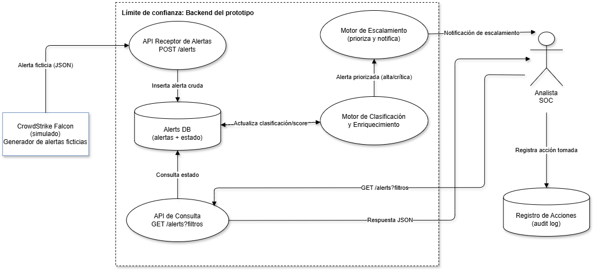

# FDSI Lab 3 — Aplicación web pública por HTTP: construir, atacar, detectar, corregir y verificar

Secure Product Challenge — MuvAutomation | Automatización de incidentes de CrowdStrike Falcon

## Equipo

- Juan David Valero Abril
- Ana Gabriela Fiquitiva Poveda

## Problemática

La recepción, clasificación, enriquecimiento y escalamiento de alertas de seguridad
requiere hoy múltiples actividades manuales, lo que aumenta los tiempos de respuesta,
dificulta la correlación de evidencias y produce criterios distintos al priorizar
incidentes.

Este repositorio contiene el **prototipo** del Lab 3: recibe alertas **ficticias** de
CrowdStrike Falcon, permite consultarlas mediante una API y registra las acciones
realizadas. No se usa información real ni se integra con CrowdStrike.

## Arquitectura (Fase A)

```
Usuario anónimo --HTTP--> Nginx (reverse proxy, :80) --> FastAPI (uvicorn, 127.0.0.1:8000) --> SQLite
```

Este es solo el primer tramo del diagrama completo del challenge
(`Usuario anónimo → Aplicación web → REST → API pública → PostgreSQL`). En el Lab 3 la
"Aplicación web" y la "API pública" son el mismo servicio FastAPI; PostgreSQL se deja
para un laboratorio posterior — SQLite es suficiente aquí y no obliga a rediseñar la API.

**Alcance intencional:** todo se expone por HTTP, sin autenticación ni cifrado. Este
riesgo se corrige en el Lab 4 (HTTPS + identidad + roles), no en este laboratorio.

## Modelo de amenazas — DFD (Fase B)



El diagrama de flujo de datos (DFD) representa el diseño objetivo del prototipo de
automatización de incidentes:

- **CrowdStrike Falcon (simulado)** — generador externo de alertas ficticias. Envía una
  alerta en JSON hacia la API mediante `POST /alerts`.
- **API Receptor de Alertas (`POST /alerts`)** — recibe la alerta y la inserta cruda en
  la base de datos.
- **Alerts DB (alertas + estado)** — almacenamiento central; guarda cada alerta y su
  estado (nueva, clasificada, escalada, etc.).
- **Motor de Clasificación y Enriquecimiento** — toma las alertas de la base de datos,
  las enriquece y actualiza su clasificación/score.
- **Motor de Escalamiento** — prioriza las alertas ya clasificadas y, cuando corresponde
  (severidad alta/crítica), genera una notificación de escalamiento hacia el analista.
- **API de Consulta (`GET /alerts?filtros`)** — permite al Analista SOC consultar el
  estado de las alertas con filtros y recibe la respuesta en JSON.
- **Analista SOC** — actor externo que recibe notificaciones de escalamiento, consulta
  alertas y registra las acciones que toma.
- **Registro de Acciones (audit log)** — almacena cada acción tomada por el analista,
  para trazabilidad (mitiga Repudiation).

El diagrama marca un único **límite de confianza** ("Backend del prototipo") que engloba
todos los componentes de procesamiento y almacenamiento; los dos actores externos
(el generador de alertas y el Analista SOC) quedan fuera de ese límite, igual que el
"Usuario anónimo" en el diagrama general del challenge.

**Relación con lo ya implementado (Fase A):** hoy el código en `app/main.py` cubre la
**API Receptor de Alertas** (`POST /alerts`), la **API de Consulta** (`GET /alerts` y
`GET /alerts/{id}`), la **Alerts DB** (SQLite) y una versión inicial del **Registro de
Acciones** (`logs/actions.log`). El **Motor de Clasificación y Enriquecimiento**, el
**Motor de Escalamiento** y las notificaciones al Analista SOC son parte del diseño
objetivo del DFD pero **todavía no están construidos** — quedan como trabajo pendiente
(probablemente para una iteración posterior del challenge, ya que el Lab 3 solo exige
una app HTTP mínima y deliberadamente insegura).

## Tabla STRIDE (Fase B)

| ID | STRIDE | Elemento afectado | Hipótesis de amenaza | Validación propuesta |
|----|--------|--------------------|------------------------|------------------------|
| H1 | Spoofing | API Receptor de Alertas (POST /alerts) | Un origen no autorizado podría enviar alertas ficticias haciéndose pasar por CrowdStrike Falcon, ya que el endpoint no valida el origen de la petición. | Enviar un POST desde una IP/token distinto al esperado y verificar si el sistema lo acepta sin rechazo. |
| H2 | Tampering | Alerts DB | Sin control de integridad, una alerta ya almacenada podría modificarse (severidad, estado) sin dejar rastro de quién hizo el cambio. | Modificar un registro directamente en la base de datos y revisar si existe un log que detecte el cambio. |
| H3 | Repudiation | Registro de Acciones (audit log) | Si el registro no asocia cada acción a un analista autenticado, un usuario podría negar haber cerrado o escalado una alerta. | Registrar una acción sin autenticación fuerte y verificar si el log permite identificar de forma inequívoca al responsable. |
| H4 | Information Disclosure | API de Consulta (GET /alerts?filtros) | La API podría exponer más campos de los necesarios (por ejemplo, detalles internos de otros equipos) a cualquier analista que consulte. | Consultar el endpoint con un usuario de bajo privilegio y revisar si devuelve campos sensibles o de otros equipos. |
| H5 | Denial of Service | Motor de Clasificación y Enriquecimiento | Un volumen alto de alertas ficticias enviadas rápidamente podría saturar el motor de clasificación y retrasar el procesamiento de alertas reales. | Simular una ráfaga de alertas (en entorno de laboratorio) y medir el tiempo de respuesta del motor. |
| H6 | Elevation of Privilege | Motor de Escalamiento | Un analista con permisos de solo lectura podría, por un control de autorización débil, forzar el escalamiento o cierre de una alerta sin tener el rol adecuado. | Intentar ejecutar una acción de escalamiento con una cuenta de bajo privilegio y verificar si el sistema la bloquea. |

**Nota:** las hipótesis deben validarse en el entorno de laboratorio con datos ficticios
únicamente, sin exponer credenciales ni información real de CrowdStrike Falcon.

Esta tabla cubre las 6 categorías STRIDE completas. De ellas, **H1** (Spoofing) y **H4**
(Information Disclosure) son directamente verificables hoy contra el código de la Fase A,
porque `POST /alerts` y `GET /alerts` ya existen y no tienen ningún control de
autenticación ni de origen. **H2, H3, H5 y H6** dependen de componentes que todavía no
están construidos (control de integridad, autenticación de analista, motores de
clasificación/escalamiento) — quedan como riesgo aceptado/pendiente hasta que esas piezas
se implementen.

## Estructura del repositorio

```
diagrams/
└── dfd-lab3.png            # DFD del prototipo (Fase B)
app/
├── main.py                 # API FastAPI: alertas + registro de acciones
└── requirements.txt
nginx/
└── muvautomation.conf      # virtual host: reverse proxy :80 -> :8000
deploy/
└── muvautomation-api.service  # unidad systemd para el Ubuntu Server del laboratorio
logs/
└── actions.log             # se genera en tiempo de ejecución (registro de acciones)
```

## Endpoints

| Método | Ruta | Descripción |
|---|---|---|
| GET | `/` | Landing informativo del portal (LAB) |
| POST | `/alerts` | Ingesta de una alerta ficticia |
| GET | `/alerts` | Lista todas las alertas (sin autenticación) |
| GET | `/alerts/{alert_id}` | Detalle de una alerta; 404 si no existe |

Cada request relevante queda registrado en `logs/actions.log` (JSON por línea: timestamp
UTC, acción, método, ruta, IP origen y `alert_id` cuando aplica), como complemento al
`access.log`/`error.log` de Nginx que se usará en la Fase D (Blue Team).

## Ejecutar en local (desarrollo/pruebas)

```bash
cd app
python -m venv .venv
source .venv/bin/activate   # en Windows: .venv\Scripts\activate
pip install -r requirements.txt
uvicorn main:app --reload
```

Pruebas rápidas:

```bash
curl -i http://127.0.0.1:8000/
curl -s -X POST http://127.0.0.1:8000/alerts \
  -H "Content-Type: application/json" \
  -d '{"severity":"high","tactic":"Initial Access","technique":"T1078 - Valid Accounts","hostname":"WEB-LAB-01","description":"Prueba de laboratorio"}'
curl -s http://127.0.0.1:8000/alerts
curl -i http://127.0.0.1:8000/alerts/no-existe
```

## Despliegue en el Ubuntu Server del laboratorio (Fase A del PDF)

Ejecutar en la instancia autorizada (no en esta máquina de desarrollo):

```bash
# Paso 1 - Verificar host y registrar línea base
hostnamectl
ip -br address
uname -a
date -u +%Y-%m-%dT%H:%M:%SZ

# Paso 2 - Instalar Nginx y Python
sudo apt update
sudo apt install -y nginx python3-venv

# Copiar el repo al servidor, por ejemplo en /opt/muvautomation
sudo mkdir -p /opt/muvautomation
# ... copiar app/ y este README ...
cd /opt/muvautomation
python3 -m venv .venv
.venv/bin/pip install -r app/requirements.txt

# Servicio systemd para la API
sudo cp deploy/muvautomation-api.service /etc/systemd/system/
sudo systemctl daemon-reload
sudo systemctl enable --now muvautomation-api
sudo systemctl status muvautomation-api --no-pager

# Virtual host Nginx (reverse proxy)
sudo cp nginx/muvautomation.conf /etc/nginx/sites-available/muvautomation
sudo ln -s /etc/nginx/sites-available/muvautomation /etc/nginx/sites-enabled/muvautomation
sudo rm -f /etc/nginx/sites-enabled/default
sudo nginx -t
sudo systemctl reload nginx
curl -i http://127.0.0.1/

# Paso 5 - Firewall limitado al segmento del laboratorio
export LAB_CIDR=CIDR_AUTORIZADO
sudo ufw default deny incoming
sudo ufw default allow outgoing
sudo ufw allow from "$LAB_CIDR" to any port 80 proto tcp
sudo ufw allow OpenSSH
sudo ufw enable
sudo ufw status numbered
```

Punto de control: verificar que la URL responde, que el firewall está limitado al
`LAB_CIDR` asignado y que todos los datos (alertas, hostnames) son ficticios antes de
autorizar las pruebas de Red Team.

## Estado del laboratorio

- **Fase A (Construir y publicar):** completa — API FastAPI + Nginx documentados y
  probados localmente.
- **Fase B (Modelar antes de atacar):** completa — DFD (`diagrams/dfd-lab3.png`) y tabla
  STRIDE con 6 hipótesis (H1-H6) documentados.
- **Fases C–F** (ataque Red Team, detección Blue Team, hardening y verificación):
  pendientes.
